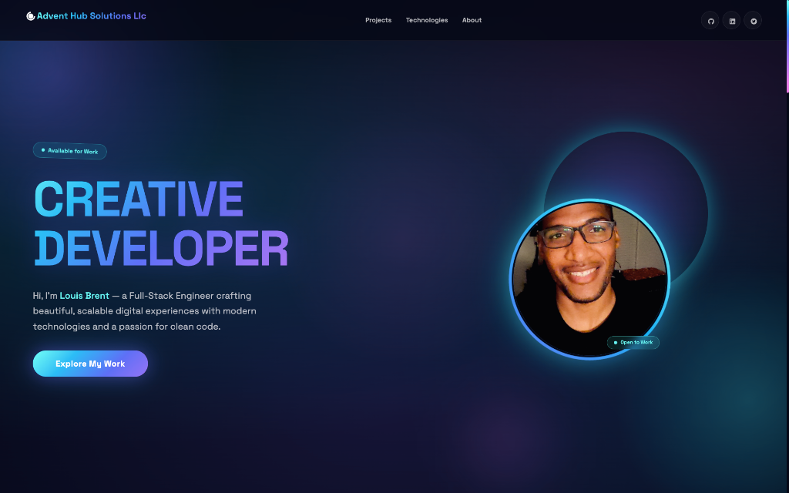

<div id="top"></div>

<!-- PROJECT SHIELDS -->
[![Contributors][contributors-shield]][contributors-url]
[![Forks][forks-shield]][forks-url]
[![Stargazers][stars-shield]][stars-url]
[![Issues][issues-shield]][issues-url]
[![MIT License][license-shield]][license-url]
[![LinkedIn][linkedin-shield]][linkedin-url]

<!-- PROJECT LOGO -->
<br />
<div align="center">
  <a href="https://github.com/louisbrent1992/My-Personal-Portfolio">
    
  </a>

<h3 align="center">Louis Brent's Portfolio</h3>

  <p align="center">
    A modern, animated portfolio showcasing my journey as a Full-Stack Developer. Built with Next.js, Styled-Components, and Framer Motion.
    <br />
    <a href="https://github.com/louisbrent1992/My-Personal-Portfolio"><strong>Explore the docs »</strong></a>
    <br />
    <br />
    <a href="https://lbprojects-portfolio-xi.vercel.app/">View Demo</a>
    ·
    <a href="https://github.com/louisbrent1992/My-Personal-Portfolio/issues">Report Bug</a>
    ·
    <a href="https://github.com/louisbrent1992/My-Personal-Portfolio/issues">Request Feature</a>
  </p>
</div>

<!-- TABLE OF CONTENTS -->
<details>
  <summary>Table of Contents</summary>
  <ol>
    <li><a href="#about-the-project">About The Project</a></li>
    <li><a href="#built-with">Built With</a></li>
    <li><a href="#featured-projects">Featured Projects</a></li>
    <li>
      <a href="#getting-started">Getting Started</a>
      <ul>
        <li><a href="#prerequisites">Prerequisites</a></li>
        <li><a href="#installation">Installation</a></li>
      </ul>
    </li>
    <li><a href="#roadmap">Roadmap</a></li>
    <li><a href="#contributing">Contributing</a></li>
    <li><a href="#license">License</a></li>
    <li><a href="#contact">Contact</a></li>
    <li><a href="#acknowledgments">Acknowledgments</a></li>
  </ol>
</details>

## About The Project

Hi, I'm **Louis Brent** — a Full-Stack Engineer crafting beautiful, scalable digital experiences with modern technologies and a passion for clean code.

This portfolio features:
- 🎨 **Premium UI/UX** — Glassmorphism effects, smooth gradients, and micro-animations
- ⚡ **Dynamic Timeline** — An interactive journey through my career milestones
- 🚀 **Project Showcase** — Live demos and source code for my best work
- 📱 **Fully Responsive** — Optimized for all device sizes
- ✨ **Framer Motion Animations** — Scroll-triggered reveals and hover effects

### By The Numbers
| Stat | Value |
|------|-------|
| 🛠️ Open Source Projects | 60+ |
| 📊 GitHub Contributions | 400+ |
| 😊 Happy Clients | 50+ |
| 📅 Years Experience | 5+ |

<p align="right">(<a href="#top">back to top</a>)</p>

### Built With

- [Next.js](https://nextjs.org/) - React framework for production
- [Styled-Components](https://styled-components.com/) - CSS-in-JS styling
- [Framer Motion](https://www.framer.com/motion/) - Animation library
- [React Icons](https://react-icons.github.io/react-icons/) - Icon library

<p align="right">(<a href="#top">back to top</a>)</p>

## Featured Projects

| Project | Description | Tech Stack |
|---------|-------------|------------|
| **Restaurant Reservation System** | A reservation system for fine dining restaurants | React, Node, PostgreSQL, Express |
| **RecipEase: AI Recipe Scanner** | AI-powered recipe generator using OpenAI | Dart, Flutter, OpenAI, DALL-E |
| **Music Label Site** | Fully responsive music label website template | React, Styled-Components |
| **Flashcards Study App** | Educational flashcard platform for teachers & students | React, Node, Bootstrap |
| **eCommerce Template** | Modern e-commerce website with full functionality | React, Redux, MongoDB, Express |

<p align="right">(<a href="#top">back to top</a>)</p>

<!-- GETTING STARTED -->

## Getting Started

To get a local copy up and running, follow these steps.

### Prerequisites

Make sure you have Node.js and npm installed.

```sh
npm install npm@latest -g
```

### Installation

1. Clone the repo
   ```sh
   git clone https://github.com/louisbrent1992/My-Personal-Portfolio.git
   ```
2. Navigate to the project directory
   ```sh
   cd My-Personal-Portfolio
   ```
3. Install NPM packages
   ```sh
   npm install
   ```
4. Start the development server
   ```sh
   npm run dev
   ```
5. Open [http://localhost:3000](http://localhost:3000) in your browser

<p align="right">(<a href="#top">back to top</a>)</p>

<!-- ROADMAP -->

## Roadmap

- [x] Dynamic timeline with animations
- [x] Project showcase with live demos
- [x] Responsive design for all devices
- [x] Dark mode glassmorphism theme
- [ ] Blog section
- [ ] Contact form integration
- [ ] i18n multi-language support

See the [open issues](https://github.com/louisbrent1992/My-Personal-Portfolio/issues) for a full list of proposed features (and known issues).

<p align="right">(<a href="#top">back to top</a>)</p>

<!-- CONTRIBUTING -->

## Contributing

Contributions are what make the open source community such an amazing place to learn, inspire, and create. Any contributions you make are **greatly appreciated**.

1. Fork the Project
2. Create your Feature Branch (`git checkout -b feature/AmazingFeature`)
3. Commit your Changes (`git commit -m 'Add some AmazingFeature'`)
4. Push to the Branch (`git push origin feature/AmazingFeature`)
5. Open a Pull Request

<p align="right">(<a href="#top">back to top</a>)</p>

<!-- LICENSE -->

## License

Distributed under the MIT License. See `LICENSE.txt` for more information.

<p align="right">(<a href="#top">back to top</a>)</p>

<!-- CONTACT -->

## Contact

**Louis Brent** - [@louisbrent1992](https://twitter.com/louisbrent1992) - louisbrent1992@gmail.com

Project Link: [https://github.com/louisbrent1992/My-Personal-Portfolio](https://github.com/louisbrent1992/My-Personal-Portfolio)

<p align="right">(<a href="#top">back to top</a>)</p>

<!-- ACKNOWLEDGMENTS -->

## Acknowledgments

- [JavaScript Mastery](https://jsmasterypro.com/)
- [Framer Motion](https://www.framer.com/motion/)
- [Styled-Components](https://styled-components.com/)

<p align="right">(<a href="#top">back to top</a>)</p>

<!-- MARKDOWN LINKS & IMAGES -->

[contributors-shield]: https://img.shields.io/github/contributors/louisbrent1992/My-Personal-Portfolio.svg?style=for-the-badge
[contributors-url]: https://github.com/louisbrent1992/My-Personal-Portfolio/graphs/contributors
[forks-shield]: https://img.shields.io/github/forks/louisbrent1992/My-Personal-Portfolio.svg?style=for-the-badge
[forks-url]: https://github.com/louisbrent1992/My-Personal-Portfolio/network/members
[stars-shield]: https://img.shields.io/github/stars/louisbrent1992/My-Personal-Portfolio.svg?style=for-the-badge
[stars-url]: https://github.com/louisbrent1992/My-Personal-Portfolio/stargazers
[issues-shield]: https://img.shields.io/github/issues/louisbrent1992/My-Personal-Portfolio.svg?style=for-the-badge
[issues-url]: https://github.com/louisbrent1992/My-Personal-Portfolio/issues
[license-shield]: https://img.shields.io/github/license/louisbrent1992/My-Personal-Portfolio.svg?style=for-the-badge
[license-url]: https://github.com/louisbrent1992/My-Personal-Portfolio/blob/master/LICENSE.txt
[linkedin-shield]: https://img.shields.io/badge/-LinkedIn-black.svg?style=for-the-badge&logo=linkedin&colorB=555
[linkedin-url]: https://linkedin.com/in/louis-brent
